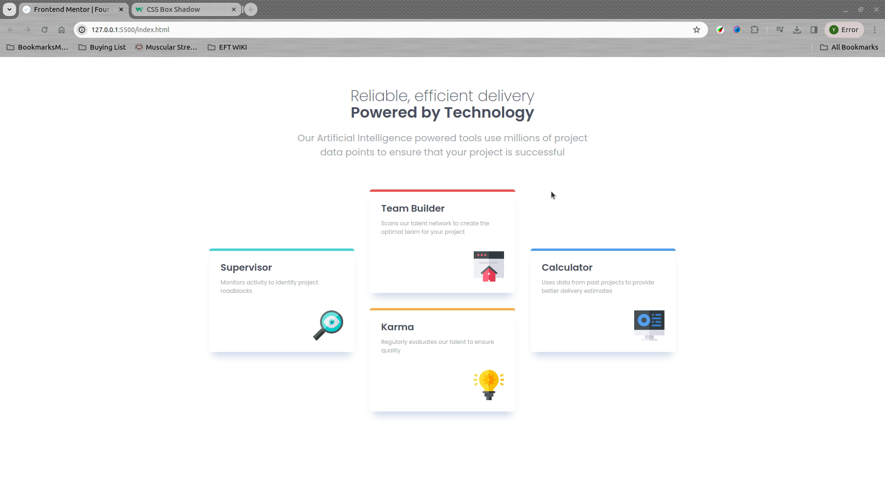
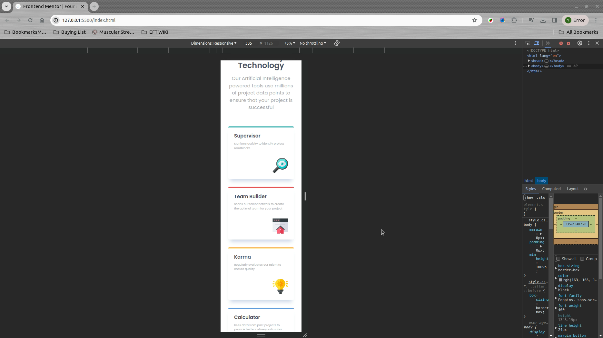

# Frontend Mentor - Four card feature section solution

This is a solution to the [Four card feature section challenge on Frontend Mentor](https://www.frontendmentor.io/challenges/four-card-feature-section-weK1eFYK). Frontend Mentor challenges help you improve your coding skills by building realistic projects. 

## Table of contents

- [Overview](#overview)
  - [The challenge](#the-challenge)
  - [Screenshot](#screenshot)
- [My process](#my-process)
  - [Built with](#built-with)
  - [What I learned](#what-i-learned)
  - [Continued development](#continued-development)
  - [Useful resources](#useful-resources)
- [Author](#author)
- [Acknowledgments](#acknowledgments)

## Overview

### The challenge

Users should be able to:

- View the optimal layout for the site depending on their device's screen size

### Screenshot

## My process

### Built with

- Semantic HTML5 markup
- CSS custom properties
- Flexbox
- CSS Grid
- Mobile-first workflow

### What I learned

As a newbie, this was my firs time working with @media queries. and also improved my box shadow styling.

If you want more help with writing markdown, we'd recommend checking out [The Markdown Guide](https://www.markdownguide.org/) to learn more.

### Useful resources

- [Example resource 1](https://www.w3schools.com/css/css3_shadows_box.asp) - This helped me for the box shadow properties and syntaxes to style the cards.
- [Example resource 2](https://developer.mozilla.org/en-US/docs/Web/CSS/CSS_media_queries/Using_media_queries) - This is an amazing article which helped me making my design responsive on devices with different screen sizes . I'd recommend it to anyone still learning this concept.

## Author

- Website - [Yousef Zamanpour](https://www.your-site.com)
- Frontend Mentor - [@YousefZamanpour](https://www.frontendmentor.io/profile/YousefZamanpour)

